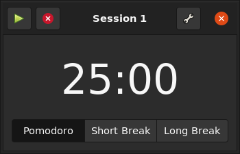
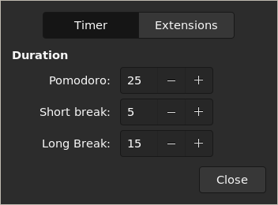
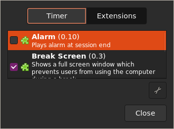

Tomate
======

A Pomodoro timer written in Gtk3 and Python for Linux desktops.

About the technique
-------------------

The Pomodoro Technique® is a management technique developed by Francesco Cirillo that helps you keep focused.
Read more about it at the [official website](http://pomodorotechnique.com/).

Pomodoro Technique® and Pomodoro™ are registered and filed trademarks owned by Francesco Cirillo.
Tomate is not affiliated by, associated with nor endorsed by Francesco Cirillo.

Screenshots
-----------

Installation
------------

### Ubuntu 20.04+

If you have installed the program using the **old ppa repository** uninstall the old version first.
If you use an Ubuntu-based distro, such as Mint, manually set the **RELEASE** variable to the Ubuntu version number, such as 16.04, rather than running the sed script bellow.

    RELEASE=`sed -n 's/VERSION_ID="\(.*\)"/\1/p' /etc/os-release`
    sudo wget -O- http://download.opensuse.org/repositories/home:/eliostvs:/tomate/xUbuntu_$RELEASE/Release.key | sudo apt-key add -
    sudo bash -c "echo 'deb http://download.opensuse.org/repositories/home:/eliostvs:/tomate/xUbuntu_$RELEASE/ ./' > /etc/apt/sources.list.d/tomate.list"
    sudo apt-get update && sudo apt-get install tomate-gtk

### Debian 10+

    RELEASE=`sed -n 's/VERSION_ID="\(.*\)"/\1/p' /etc/os-release`
    sudo wget -O- http://download.opensuse.org/repositories/home:/eliostvs:/tomate/Debian_$RELEASE/Release.key | sudo apt-key add -
    sudo bash -c "echo 'deb http://download.opensuse.org/repositories/home:/eliostvs:/tomate/Debian_$RELEASE/ ./' > /etc/apt/sources.list.d/tomate.list"
    sudo apt-get update && sudo apt-get install tomate-gtk

### Opensuse Tumbleweed

    sudo zypper ar -f http://download.opensuse.org/repositories/home:/eliostvs:/tomate/openSUSE_Tumbleweed/home:eliostvs:tomate.repo
    sudo zypper install tomate-gtk

### Fedora 32+

    RELEASE=`cat /etc/fedora-release | grep -o '[0-9][0-9]*'`
    sudo dnf config-manager --add-repo http://download.opensuse.org/repositories/home:/eliostvs:/tomate/Fedora_$RELEASE/home:eliostvs:tomate.repo
    sudo dnf install tomate-gtk

### Arch

The packages are available in [aur repository](https://aur.archlinux.org/packages/tomate-gtk/)

Official Plugins
----------------

All plugins are in the repositories and need to be installed separately.
For example `sudo apt-get install tomate-indicator-plugin` will install the indicator plugin under Debian and Ubuntu.

- [Alarm (tomate-alarm-plugin)][alarm-plugin] Plays a sound when the timer ends
- [Notify (tomate-notify-plugin)][notify-plugin] Shows notification end the timer starts, stops or ends
- [Indicator (tomate-indicator-plugin)][indicator-plugin] Shows the timer countdown in the systray **when the timer is running** (requires libappindicator)
- [StatusIcon (tomate-statusicon-plugin)][statusicon-plugin] Shows the timer countdown in the systray **when the timer is running**
- [Launcher (tomate-launcher-plugin)][launcher-plugin] Shows the timer countdown and the total of sessions in the launcher (ubuntu only)
- [Scripts (tomate-exec-plugin)][exec-plugin] Run scripts when the timer starts, stops or ends.
- [Break Screen (tomate-breakscreen-plugin)][breakscreen-plugin] Block screen during break

License
-------

This program is free software: you can redistribute it and/or modify it
under the terms of the GNU General Public License version 3, as published
by the Free Software Foundation.

This program is distributed in the hope that it will be useful, but
WITHOUT ANY WARRANTY; without even the implied warranties of
MERCHANTABILITY, SATISFACTORY QUALITY, or FITNESS FOR A PARTICULAR
PURPOSE.  See the GNU General Public License for more details.

You should have received a copy of the GNU General Public License along
with this program.  If not, see <http://www.gnu.org/licenses/>.

[alarm-plugin]: https://github.com/eliostvs/tomate-alarm-plugin
[notify-plugin]: https://github.com/eliostvs/tomate-notify-plugin
[indicator-plugin]: https://github.com/eliostvs/tomate-indicator-plugin
[statusicon-plugin]: https://github.com/eliostvs/tomate-statusicon-plugin
[launcher-plugin]: https://github.com/eliostvs/tomate-launcher-plugin
[exec-plugin]: https://github.com/eliostvs/tomate-exec-plugin
[breakscreen-plugin]: https://github.com/eliostvs/tomate-breakscreen-plugin
